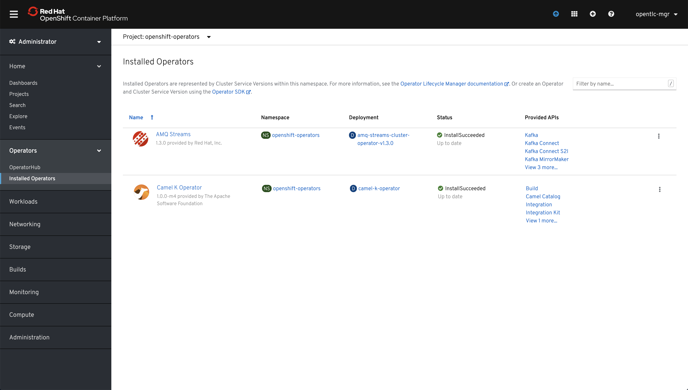

# State Machine Assistant

## Intro

Some months ago I started playing with [Camel K](https://github.com/apache/camel-k), I instantanly fell in love with it (and I didn't have any previous experience with Camel), easy to deploy fast development, tons of components, you name it. As it usually happens (not just to me, right ;-) ) we tech people try a new good thing and if we love it... we tend to use it everywhere... ok, that was my case, I started to think of crazy scenarios, but one of them stood out and after some refinement ended up being this project.

> **NOTE:** Ideally you will read and do and see results... and (hopefully) learn some basics to create your own EDA (Event Driven Application). This lab is not really about creating everything from scratch but more about having an example project up and running and then exploring posibilities while learning.

### The idea

The idea came to me after remembering how many times I had to go with my youngest daugher to the Emergency Room (nothing serious but recurrent) and all those times waiting for results, moving to the next stage and informing my wife (who was with my other daughter). Wouldn't if be nice to receive a message to my Telegram App everytime the state of the patient changes? Well, that's the aim of this project: serving as an example EDA (Event Driven Application) running on Kubernetes/OpenShift that sends out notifications via a Telegram Bot whenever the state/status of a patient changes.

In order to give our example EDA a bit more of (ficticious) context, let's imagine there's a Health Information System (HIS) at a hospital called Black Moutain Hospital. This application has a UI where you can change the status of a patient and everytime a change happens a proper HL7 message is sent.

> **NOTE:** this is an over simplified HIS, please health related profesionals don't get too mad at me, I know how complex a real HIS is ;-)

The scenario protrayed by this example application of the **ficticious Black Mountain Hospital** comprises these elements:

* **HIS frontend (Angular JS)** where you can change the status of a patient
* **HIS backend (Spring Boot REST API)** exposing the patient info API, data is persisted in a PostgreSQL Database. This piece sends out HL7 messages to a Kafka topic
* **Integration layer (Camel K)** that translates HL7 events to plain events you can send to a human
* **Telegram Bot (Node JS)** where you can signup with your ID, again data is persisted in a PostgreSQL Database

## Prerequistes

You need access to an OpenShift 4.2+ cluster and be cluster-admin (or request your administrator to install a couple of elements for you). You can also run  your own local 4.x cluster using [CodeReady Containers](https://code-ready.github.io/crc/).

## Scope

In this guide we'll cover:

* the deployment of infrastructure elements in OpenShift: databases, kafka cluster, etc.
* local development of UI, services and also the integration layer
* the deployment of services on OpenShift

## Get yourself ready

Git clone this repository and change dir... the usual.

## Deployment of infrastructure

We need to deploy a couple of databases, Kafka and also Camel K... let's get to it.

### Deploying Kafka 

In order to ease the deployment of Kafka we're going to use the `Red Hat AMQ Operator` (go [here](http://red.ht/operators) to learn more about operators).

> **WARNING:** This task should be run by a cluster administrator

Log in as a cluster admin to your cluster and go to `Operators->Operator Hub`. 


In the search field start typing `amq`. Then click on `AMQ Streams`.


Click on `Install`.


Leave the default values and click `Subscribe`, as you can see we're going to install the operator so that it's available to all namespaces. This will allow to use the operator as a normal user in any namespace.


Wait until `Status` changes to `InstallSucceeded`.


If status is `InstallSucceeded` you have installed the operator successfully in namespace `openshift-operators`.


Now you could start creating custom resources managed by the AMQ Streams Operator, such as `Kafka`, `Kafka Connect`, etc.


### Deploying the Camel K Operator

As we have exmplained before we need a couple of Camel integrations; to translate HL7 messages coming in to a Kafka topic and another one to send those translated messages to a Telegram Bot. Well, in order to run this Camel integrations (routes) we can do it mannually in a Java project, or use Camel K. For all the reasons mentiones before and more we're going to use an operator the `Camel K Operator`.

> **WARNING:** This task should be run by a cluster administrator

Log in as to your cluster as cluster-admin and go to `Operators->Operator Hub`. 


In the search field start typing `camel`. Then click on `Camel K`.


Click on `Continue`.


Click on `Install`.


Leave the default values and click `Subscribe`, as you can see we're going to install the operator so that it's available to all namespaces. This will allow to use the operator as a normal user in any namespace.


Wait until `Status` changes to `InstallSucceeded`, if that is the case you have installed the operator successfully in namespace `openshift-operators`.




Now you could start creating custom resources managed by the `Camel K Operator`, such as `Integration`, `Build`, etc.

### Deploying Kafka using the AMQ Streams Operator

As we mentioned before we need a couple of Topics, one for HL7 events and another one for translated events... and of course we need a Kafka cluster to support them.

> **NOTE:** This task and the next ones don't require special permissions apart from being able to create namespaces, deployments, PODs, etc.

We have prepared a set of numbered shell scripts, please have a look to the one numbered `00` where some base environment variables are set. You may need to change the project name to be sure it's unique in your cluster...

Set the environment any time by doing this. Please run the next command, we'll need to use $PROJECT_NAME environemt variable later:

```sh
. ./00-environment.sh
```

In this step we will run `./01-deploy-kafka.sh`, please have a look to this script, there are a couple of important bits there.

**First**, it creates a project to hold all the elements. Next is the excerpt 

```sh
oc new-project ${PROJECT_NAME}
```

> **<span style="color:red">IMPORTANT:</span>** if you run the scripts in order (and you don't create another project in between), the default project will be automatically set to the project create, that is the one set by $PROJECT_NAME environment varible, see `00-environment.sh`. If you have created another project or just want to be sure the default project is set correctly, please use: `oc project`. If you need to set the default project back to $PROJECT_NAME do this: `. ./00-environment.sh && oc project $PROJECT_NAME` 

**Second**, it also creates a Custom Resource (CR) of type `Kafka` that defines a Kafka cluster with 3 replicas, three listeners, plain, secure and https based (external). And a couple of CRs of type `KafkaTopic` for each of the kafka topics we need.

> **NOTE 1:** The `AMQ Streams Operator` reacts to the creation/update/delete of a set of Custom Resource Definitions, go [here](https://access.redhat.com/documentation/en-us/red_hat_amq/7.3/html/using_amq_streams_on_openshift_container_platform/getting-started-str#cluster-operator-str) for further details

> **NOTE 2:** The **external listener** is needed only while running the backend logic locally because the kafka cluster is running in OpenShift. In general this external listener is not needed when the logic run in the same cluster as the kafka cluster.

Now please run the script.

> **WARNING:** Be sure you're logged in, if unsure run `oc whoami`

```sh
./01-deploy-kafka.sh
```

To monitor the status of the deployment you can run the next command.

> As you can see, there are 3 replicas both for the kafka cluster and for the zookeeper cluster, all of them are running.

```sh
$ oc get pod -n $PROJECT_NAME | grep state-machine-cluster
state-machine-cluster-entity-operator-55d6f79ccf-dckht   3/3     Running     16         5d15h
state-machine-cluster-kafka-0                            2/2     Running     11         5d15h
state-machine-cluster-kafka-1                            2/2     Running     11         5d15h
state-machine-cluster-kafka-2                            2/2     Running     11         5d15h
state-machine-cluster-zookeeper-0                        2/2     Running     8          5d15h
state-machine-cluster-zookeeper-1                        2/2     Running     8          5d15h
state-machine-cluster-zookeeper-2                        2/2     Running     8          5d15h
```

Another test you can run, this one to check if our topics were created properly.

```sh
$ oc rsh -n $PROJECT_NAME state-machine-cluster-kafka-0 bin/kafka-topics.sh --list --bootstrap-server localhost:9092
Defaulting container name to kafka.
Use 'oc describe pod/state-machine-cluster-kafka-0 -n state-machine-assistant' to see all of the containers in this pod.
OpenJDK 64-Bit Server VM warning: If the number of processors is expected to increase from one, then you should configure the number of parallel GC threads appropriately using -XX:ParallelGCThreads=N
__consumer_offsets
events-topic
hl7-events-topic
```

### Install Camel K CLI

This step is quite easy... it only requires to download the Camel K CLI binary, `kamel`.

Please run this script.

> **NOTE:** open the script `00-environment.sh` if you want to change the cli version

```sh
./02-install-camel-k-cli.sh
```

This script leaves the `kamel` binary in the same directory where the script is run... so it's not in your *PATH* so be sure to execute it like this `./kamel` or add it to you *PATH*.

### Deploying the HIS Backend and Telegram Bot databases

We're going to use `oc new-app` commands to deploy two single node PostgreSQL databases, one for the HIS backend and another one for the Telegram Bot.

If you have a look to script `03` you'll find the next couple of commands, these are normal `oc new-app` commands that create the needed descriptors to run an OCI image `centos/postgresql-10-centos7`. 

Pay attention to the following:

1. We are deploying the same image twice because we need two databases
2. The name given to the application is different: backend-database vs telegram-bot-database
3. Finally, there are a couple of environment variables that set user and password with the same values for both databases. Yes, not very secure... but remember this is for development purposes

```sh
oc new-app -e POSTGRESQL_USER=luke -ePOSTGRESQL_PASSWORD=secret -ePOSTGRESQL_DATABASE=my_data \
    centos/postgresql-10-centos7 --name=backend-database

oc new-app -e POSTGRESQL_USER=luke -ePOSTGRESQL_PASSWORD=secret -ePOSTGRESQL_DATABASE=my_data \
    centos/postgresql-10-centos7 --name=telegram-bot-database
```

Now run the script.

```sh
./03-deploy-databases.sh
```

Check the status of the deployment with this command. Eventually you should see something like this where the status of our database pods is `Running`, like `backend-database-1-ttq2b` in this example output.

```sh
$ oc get pod -n $PROJECT_NAME | grep database
backend-database-1-deploy                                0/1     Completed   0          5m
backend-database-1-ttq2b                                 1/1     Running     4          4m
telegram-bot-database-1-7qv4d                            1/1     Running     4          4m
telegram-bot-database-1-deploy                           0/1     Completed   0          5m
```

## Preparing the development environment

One of the goals of the lab is to help you with the local development stage. For instance, regarding the HIS backend, our Spring Boot service (Java) needs to be able to connect to an HTTPS listener, hence you need the root CA certificate related to that listener added as a trusted CA to a keystore.

To do so, we have prepared this script `./04-prepare-development-env.sh`. It basically does the following:

*Extracts the root CA cert from a secret*

```sh 
oc extract secret/${CLUSTER_NAME}-cluster-ca-cert -n ${PROJECT_NAME} --keys=ca.crt --to=- > src/main/resources/ca.crt
```

*Adds it to a Java Keystore*

```sh
keytool -delete -alias root -keystore src/main/resources/keystore.jks -storepass password -noprompt
keytool -import -trustcacerts -alias root -file src/main/resources/ca.crt -keystore src/main/resources/keystore.jks -storepass password -noprompt
```

How does the Spring Boot application know which Keystore use to connect to kafka?

Well, there's a class called `KafkaConfig` that prepares the configuration to connect to Kafka, open file `backend/src/main/java/com/redhat/his/service/KafkaConfig.java` to see how we use `NONE` to exclude some properties when running in OpenShift.

```java
package com.redhat.his.service;

import java.util.Properties;

...

@Configuration
public class KafkaConfig {
	
	@Value("${kafka.bootstrap-servers}")
	private String kafkaBrokers;
	
	@Value("${kafka.clientId}")
	private String clientId;

	@Value("${kafka.groupId}")
	private String groupId;

	@Value("${kafka.topic}")
	private String topicName;

	@Value("${kafka.security.protocol}")
	private String securityProtocol;
	
	@Value("${kafka.ssl.truststore.location}")
	private String sslTruststoreLocation;

	@Value("${kafka.ssl.truststore.password}")
	private String sslTruststorePassword;

	@Value("${kafka.ssl.keystore.location}")
	private String sslKeystoreLocation;

	@Value("${kafka.ssl.keystore.password}")
	private String sslKeystorePassword;

	...
}
```

Then we have to different profiles `default` and `openshift`, so, when developing we use `default` (application.properties) and when running in OpenShift we use `openshift` (application-opeshift.properties).

Next you can find the relevant properties in the `default` profile.

```properties
# Kafka Bootstrap Servers => ./06-run-backend.sh sets KAFKA_SERVICE_HOST automatically for local dev.
kafka.bootstrap-servers=${KAFKA_SERVICE_HOST}:443

# Client and Group
kafka.clientId	= kafkaClientHisBackend
kafka.groupId	= kafkaHisBackendConsumerGroup

# Topics
# kafka.topic		= kafka-clients-demo
kafka.topic = hl7-events-topic

kafka.security.protocol = SSL

kafka.ssl.truststore.location = src/main/resources/keystore.jks
kafka.ssl.truststore.password = password

kafka.ssl.keystore.location = src/main/resources/keystore.jks
kafka.ssl.keystore.password = password
```

And this is the `openshift` profile cuonterpart.

```properties
# Kafka Bootstrap Servers
kafka.bootstrap-servers=state-machine-cluster-kafka-brokers:9092

# Client and Group
kafka.clientId	= kafkaClientHisBackend
kafka.groupId	= kafkaHisBackendConsumerGroup

# Topics
kafka.topic = hl7-events-topic

kafka.security.protocol = NONE

kafka.ssl.truststore.location = NONE
kafka.ssl.truststore.password = NONE

kafka.ssl.keystore.location = NONE
kafka.ssl.keystore.password = NONE

```

The other thing done by `./04-prepare-development-env.sh` is to install all dependencies needed by the Telegram Bot and the HIS Front end, bot Node JS applications.

Now please run this command.

```sh
./04-prepare-development-env.sh
```

## Developing our EDA locally

So there are 4 pieces we need to be able to run locally first and then move to our OpenShift cluster, namely:

* Telegram Bot
* HIS Backend
* Integrations
    * HL7 to Events Integration
    * Events to Telegram Bot Integration
* HIS Frontend

Let's run them test them one by one

### Telegram Bot

First you need to use BotFather in order to create you Telegram Bot

Go to your Telegram App, here we'll show you haow to do it with the desktop app but it should work in any supported platform.

Look for BotFather.


Now create a new bot with `/newbot`. Just follow the steps, when done you should receive a token, please copy it.


Time to paste this token, open `./05a-run-telegram-bot.sh` and paste it when required.

> Run this script in an new terminal window. Be aware that it will use `oc port-forward` to open a tunnel with the database running in OpenShift. By the way this script could also work properly completely local if you uncomment the required lines `Using docker to run a database`.

```sh
$ . ./00-environment.sh
$ ./05a-run-telegram-bot.sh 
PASTE TOKEN: YOUR_TOKEN
USING TOKEN YOUR_TOKEN
> telegram-bot@1.0.0 start /Users/cvicensa/Projects/openshift/tap/state-machine-assistant/telegram-bot
> node app.js

node-telegram-bot-api deprecated Automatic enabling of cancellation of promises is deprecated.
In the future, you will have to enable it yourself.
See https://github.com/yagop/node-telegram-bot-api/issues/319. internal/modules/cjs/loader.js:959:30
DEV: true
body-parser deprecated bodyParser: use individual json/urlencoded middlewares app.js:21:9
body-parser deprecated undefined extended: provide extended option node_modules/body-parser/index.js:105:29
Health Assistant Bot has started. Start conversations in your Telegram.
Telegram Bot started at: Tue Jan 14 2020 16:06:36 GMT+0100 (Central European Standard Time) on port: 9090
Error: connect ECONNREFUSED 127.0.0.1:5432
    at TCPConnectWrap.afterConnect [as oncomplete] (net.js:1129:14) {
  errno: 'ECONNREFUSED',
  code: 'ECONNREFUSED',
  syscall: 'connect',
  address: '127.0.0.1',
  port: 5432
}
Forwarding from 127.0.0.1:5432 -> 5432
Forwarding from [::1]:5432 -> 5432
```

Hopefully your Telegram Bot is running in localhost and is connected to PostgreSQL (local or remote). Let's test it.

First, open your Telegram App and look for your bot, in our case `state machin` finds our bot. Second click on `START`


As you can see some help is displayed.


Create a user (in our case user already existed).

```sh
/signup 9876543210W
```


Finally send a message and see the result in your Telegram App. Something like `Patient JOHN SMITH with ID(PATID1234) has been admitted (ZZZ)`

```sh
./telegram-bot/send-message.sh 9876543210W http://localhost:9090
```


### Deploy the Telegram Bot

Before we can run the integration leyer we need to deploy the Telegram Bot to OpenShift.

> **INFO:** This is so, because the integration layer runs in the cluster so it would be required for your local Telegram Bot to be listening in an external IP reachable from the cluster

We're going to deploy our application using [Nodeshift](https://github.com/nodeshift/nodeshift). Nodeshift helps us deploying our NodeJS application from the command line. in order to do that you have to provide minimal information in the shape of YAML descriptors in a folder named `.nodeshift` and being logged in to an OpenShift cluster.

Here's a list of descriptors already prepared for deploying the Telegram Bot:

* 


### HIS Backend

Now it's time to run, locally, our Spring Boot HIS API. In order to do so we run [./06-run-backend.sh](./06-run-backend.sh). Open a new terminal and run it:

> **INFO:** This script runs our application which connects to the Kafka topic $HL7_EVENTS_TOPIC. If you're wondering why it connects to the Kafka cluster, the answer is this environment variable KAFKA_SERVICE_HOST. When run locally it's filled with the result of running this command: `=$(oc -n ${PROJECT_NAME} get routes ${CLUSTER_NAME}-kafka-bootstrap -o=jsonpath='{.status.ingress[0].host}{"\n"}')`, when running in OpenShift the value is predefined in `application-openshifr.properties` and equals to `state-machine-cluster-kafka-brokers:9092`. 

```sh
./06-run-backend.sh
```

If it all works properly you should get something like this:

```sh
...
2020-01-14 19:22:44.229  INFO 80644 --- [  restartedMain] o.a.k.clients.consumer.ConsumerConfig    : ConsumerConfig values: 
	auto.commit.interval.ms = 5000
	auto.offset.reset = latest
	bootstrap.servers = [state-machine-cluster-kafka-bootstrap-state-machine-assistant.apps.cluster-kharon-be2a.kharon-be2a.example.opentlc.com:443]
	check.crcs = true
	client.id = 
	connections.max.idle.ms = 540000
	default.api.timeout.ms = 60000
	enable.auto.commit = false
	exclude.internal.topics = true
	fetch.max.bytes = 52428800
	fetch.max.wait.ms = 500
	fetch.min.bytes = 1
	group.id = kafkaHisBackendConsumerGroup
	heartbeat.interval.ms = 3000
	interceptor.classes = []
	internal.leave.group.on.close = true
	isolation.level = read_uncommitted
	key.deserializer = class org.apache.kafka.common.serialization.LongDeserializer
	max.partition.fetch.bytes = 1048576
	max.poll.interval.ms = 300000
	max.poll.records = 500
	metadata.max.age.ms = 300000
	metric.reporters = []
	metrics.num.samples = 2
	metrics.recording.level = INFO
	metrics.sample.window.ms = 30000
	partition.assignment.strategy = [class org.apache.kafka.clients.consumer.RangeAssignor]
	receive.buffer.bytes = 65536
	reconnect.backoff.max.ms = 1000
	reconnect.backoff.ms = 50
	request.timeout.ms = 30000
	retry.backoff.ms = 100
	sasl.client.callback.handler.class = null
	sasl.jaas.config = null
	sasl.kerberos.kinit.cmd = /usr/bin/kinit
	sasl.kerberos.min.time.before.relogin = 60000
	sasl.kerberos.service.name = null
	sasl.kerberos.ticket.renew.jitter = 0.05
	sasl.kerberos.ticket.renew.window.factor = 0.8
	sasl.login.callback.handler.class = null
	sasl.login.class = null
	sasl.login.refresh.buffer.seconds = 300
	sasl.login.refresh.min.period.seconds = 60
	sasl.login.refresh.window.factor = 0.8
	sasl.login.refresh.window.jitter = 0.05
	sasl.mechanism = GSSAPI
	security.protocol = SSL
	send.buffer.bytes = 131072
	session.timeout.ms = 10000
	ssl.cipher.suites = null
	ssl.enabled.protocols = [TLSv1.2, TLSv1.1, TLSv1]
	ssl.endpoint.identification.algorithm = https
	ssl.key.password = null
	ssl.keymanager.algorithm = SunX509
	ssl.keystore.location = src/main/resources/keystore.jks
	ssl.keystore.password = [hidden]
	ssl.keystore.type = JKS
	ssl.protocol = TLS
	ssl.provider = null
	ssl.secure.random.implementation = null
	ssl.trustmanager.algorithm = PKIX
	ssl.truststore.location = src/main/resources/keystore.jks
	ssl.truststore.password = [hidden]
	ssl.truststore.type = JKS
	value.deserializer = class org.apache.kafka.common.serialization.StringDeserializer

2020-01-14 19:22:44.391  INFO 80644 --- [  restartedMain] o.a.kafka.common.utils.AppInfoParser     : Kafka version : 2.0.1
2020-01-14 19:22:44.391  INFO 80644 --- [  restartedMain] o.a.kafka.common.utils.AppInfoParser     : Kafka commitId : fa14705e51bd2ce5
>>> init() with topics = hl7-events-topic
2020-01-14 19:22:44.898  INFO 80644 --- [  restartedMain] o.s.s.concurrent.ThreadPoolTaskExecutor  : Initializing ExecutorService 'applicationTaskExecutor'
2020-01-14 19:22:44.953  WARN 80644 --- [  restartedMain] aWebConfiguration$JpaWebMvcConfiguration : spring.jpa.open-in-view is enabled by default. Therefore, database queries may be performed during view rendering. Explicitly configure spring.jpa.open-in-view to disable this warning
2020-01-14 19:22:45.024  INFO 80644 --- [       Thread-8] org.apache.kafka.clients.Metadata        : Cluster ID: JiCToAYZTHCDpbNYVyMlKA
2020-01-14 19:22:45.029  INFO 80644 --- [       Thread-8] o.a.k.c.c.internals.AbstractCoordinator  : [Consumer clientId=consumer-1, groupId=kafkaHisBackendConsumerGroup] Discovered group coordinator state-machine-cluster-kafka-1-state-machine-assistant.apps.cluster-kharon-be2a.kharon-be2a.example.opentlc.com:443 (id: 2147483646 rack: null)
2020-01-14 19:22:45.038  INFO 80644 --- [  restartedMain] o.s.b.a.w.s.WelcomePageHandlerMapping    : Adding welcome page: class path resource [static/index.html]
2020-01-14 19:22:45.040  INFO 80644 --- [       Thread-8] o.a.k.c.c.internals.ConsumerCoordinator  : [Consumer clientId=consumer-1, groupId=kafkaHisBackendConsumerGroup] Revoking previously assigned partitions []
2020-01-14 19:22:45.040  INFO 80644 --- [       Thread-8] o.a.k.c.c.internals.AbstractCoordinator  : [Consumer clientId=consumer-1, groupId=kafkaHisBackendConsumerGroup] (Re-)joining group
2020-01-14 19:22:45.270  INFO 80644 --- [  restartedMain] o.s.b.a.e.web.EndpointLinksResolver      : Exposing 2 endpoint(s) beneath base path '/actuator'
2020-01-14 19:22:45.340  INFO 80644 --- [  restartedMain] o.s.b.w.embedded.tomcat.TomcatWebServer  : Tomcat started on port(s): 8080 (http) with context path ''
2020-01-14 19:22:45.342  INFO 80644 --- [  restartedMain] com.redhat.his.BoosterApplication        : Started BoosterApplication in 6.678 seconds (JVM running for 7.135)
2020-01-14 19:22:47.966  INFO 80644 --- [       Thread-8] o.a.k.c.c.internals.AbstractCoordinator  : [Consumer clientId=consumer-1, groupId=kafkaHisBackendConsumerGroup] Successfully joined group with generation 102
2020-01-14 19:22:47.968  INFO 80644 --- [       Thread-8] o.a.k.c.c.internals.ConsumerCoordinator  : [Consumer clientId=consumer-1, groupId=kafkaHisBackendConsumerGroup] Setting newly assigned partitions [hl7-events-topic-0]
```

Let's run some tests, for instance let's get all the patients in the dabase. Let's remember that when run locally, `default` profile is used and H2 is the database, not PostgreSQL. Please run this command from a different terminal.

```sh
$ curl http://localhost:8080/api/patients
[{"patientId":1,"personalId":"0123456789Z","firstName":"JOHN","lastName":"SMITH","stage":"idle"},{"patientId":2,"personalId":"9876543210W","firstName":"PETER","lastName":"JONES","stage":"idle"}]
```

### The integration layer

The integration layer comprises two Java classes implementing two Camel routes:

* HL7 to Events: which receives HL7 messages, translate them to human readable text and send them to a different topic
* Events to Telegram Bot: which receives Events and pass them through to the Telegram Bot

Theses are the relevant lines of code of class `HL7ToEvents`

> There is just one route `hl7-to-patient-info` that
> 1. starts from a kafka topic: `from("kafka:{{kafka.from.topic}}...")`
> 2. then, sets some catches for exceptions: `.onException(...)`
> 3. later, it translates from HL7 messages using the good old [HAPI](https://hapifhir.github.io/hapi-hl7v2/) libraries: `.process(exchange -> ...`
> 4. Finally after some convertion the human readable message is sent to another topic: `.to("kafka:{{kafka.to.topic}}...")`

```java
import ...

public class HL7ToEvents extends RouteBuilder {
  @Override
  public void configure() throws Exception {
    
    from("kafka:{{kafka.from.topic}}?brokers={{kafka.bootstrap-servers}}&groupId={{kafka.groupId}}")
        .routeId("hl7-to-patient-info")
        .onException(Exception.class)
            .handled(true)
            .log(LoggingLevel.ERROR, "Error connecting to server, please check the application.properties file ${exception.message}")
            .end()
        .onException(HL7Exception.class)
            .handled(true)
            .log(LoggingLevel.ERROR, "Error unmarshalling ${exception.message}")
            .end()
        .log("Route started from Telegram")
        .log("body: ${body}")
        .process(exchange -> {
            String encodedMessage = exchange.getIn().getBody(String.class);
            ...
            String decodedMessage = new String(decodedBytes);
            ...
            HapiContext context = new DefaultHapiContext();
            ...
            Message hapiMessage   = p.parse(decodedMessage);
            
            Terser terser = new Terser(hapiMessage);
            
            String sendingApplication = terser.get("/.MSH-3-1");

            String msgCode = terser.get("/.MSH-9-1");
            String msgTriggerEvent = terser.get("/.MSH-9-2");
            ...
            Map<String, String> data = new HashMap<String, String>();
            ...
            data.put("message", message + " in Black Mountain");
            data.put("personalId", personalId); 
            data.put("patientId", patientId);

            exchange.getIn().setBody(data);
        })
        // marshall to JSON with GSON
        .marshal().json(JsonLibrary.Gson)
        .log("Converting to JSON data: ${body}")
        .convertBodyTo(String.class)
        .log("Sending message ${body} to topic {{kafka.to.topic}}")
        .to("kafka:{{kafka.to.topic}}?brokers={{kafka.bootstrap-servers}}&groupId={{kafka.groupId}}")
        .log("Event sent successfully: ${body}");
  }
}
```

Next you can find the relevant lines of code of the second part of the integration layer, class `EventsToTelegramBot`.

> This integration comprises two routes, the 1st one `events-to-bot` is even simpler:
> 1. Again it starts from a topic: `from("kafka:{{kafka.from.topic}}...")`
> 2. Then some exception handling: `.onException(...)`
> 3. Pass the message to the other route: `.to("direct:send-event-to-bot")`

> The 2nd route `send-event-to-bot`
> 1. Sets some header to configure the `http` component: `.setHeader(...)`
> 2. Send the message to the Telegram Bot using the `http` component: `.to("http://{{telegram-bot.host}}:{{telegram-bot.port}}/new-message")`

```java
import ...

public class EventsToTelegramBot extends RouteBuilder {
  @Override
  public void configure() throws Exception {
    
    from("kafka:{{kafka.from.topic}}?brokers={{kafka.bootstrap-servers}}&groupId={{kafka.groupId}}")
        .routeId("events-to-bot")
        .onException(Exception.class)
            .handled(true)
            .log(LoggingLevel.ERROR, "Error connecting to server, please check the application.properties file ${exception.message}")
            .end()
        .log("Route started from Kafka Topic {{kafka.from.topic}}")
        .log("body: ${body}")
        .log("Sending message to telegram bot http://{{telegram-bot.host}}:{{telegram-bot.port}}/new-message: ${body}")
        .to("direct:send-event-to-bot")
        .log("Event sent successfully: ${body}");

    from("direct:send-event-to-bot")
        .routeId("send-event-to-bot")
        .setHeader("id", header(Exchange.TIMER_COUNTER))
        .setHeader(Exchange.HTTP_METHOD, constant("POST"))
        .setHeader(Exchange.CONTENT_TYPE, constant("application/json"))
        .setHeader(Exchange.HTTP_CHARACTER_ENCODING, constant("UTF-8"))
        .log("Executing saga #${headers} ${body}")
        .to("http://{{telegram-bot.host}}:{{telegram-bot.port}}/new-message")
        .log("Patient info sent successfully: ${body}");
  }
}
```

Let's run our integrations in two different (additional) terminal windows:

* `07a-run-integration.sh` in charge of translating from HL7 to human readable text events
* `07b-run-integration.sh` in charge of sending those events to the Telegram Bot

So, please in a different terminal run:

```sh
$ ./07a-run-integration.sh
```

And yet in another terminal window, run:

```sh
$ ./07b-run-integration.sh
```

Let's run a test that generates a change in the status of a patient:

> **NOTE:** In order for this test to work you should have signed up the personalId. You should have done this before when testing the Telegram Bot.

```sh
curl -H 'Content-Type: application/json' -X PUT \
  -d '{"patientId":2,"personalId":"9876543210W","firstName":"PETER","lastName":"JONES","stage":"admission"}' \
  http://localhost:8080/api/patients/2
```

If it all works properly no error should be received and a message should be sent to the Telegram App.

In the 7a integration window you should see something like:

```sh
[1] 2020-01-14 18:40:20.873 INFO  [Camel (camel-k) thread #1 - KafkaConsumer[hl7-events-topic]] hl7-to-patient-info - Route started from Telegram
[1] 2020-01-14 18:40:20.873 INFO  [Camel (camel-k) thread #1 - KafkaConsumer[hl7-events-topic]] hl7-to-patient-info - body: TVNIfF5+XCZ8QURUMXxNQ018TEFCQURUfE1DTXwxOTg4MDgxODExMjZ8U0VDVVJJVFl8QURUXkEwNHxNU0cwMDAwMXxQfDIuNA1FVk58QTA0fDIwMDUwMTEwMDQ1NTAyfHx8fHwNUElEfHwyfDk4NzY1NDMyMTBXfHxKT05FU15QRVRFUnx8MTk2MTA2MTV8TXx8MjEwNi0zfDEyMDAgTiBFTE0gU1RSRUVUXl5HUkVFTlNCT1JPXk5DXjI3NDAxLTEwMjB8R0x8KDkxOSkzNzktMTIxMnwoOTE5KTI3MS0zNDM0fig5MTkpMjc3LTMxMTR8fFN8fDk4NzY1NDMyMTBXNTAwMV4yXk0xMHwxMjM0NTY3ODl8OS04NzY1NF5OQw1QVjF8MXxJfEVSXl5eXl5eQnxFfHx8MzdeTUFSVElORVpeSk9ITl5eXl5eXkFjY01ncl5eXl5DSXx8fDAxfHx8fDF8fHwzN15NQVJUSU5FWl5KT0hOXl5eXl5eQWNjTWdyXl5eXkNJfDJ8NDAwMDc3MTZeXl5BY2NNZ3JeVk58NHx8fHx8fHx8fHx8fHx8fHx8fHwxfHxHfHx8MjAwNTAxMTAwNDUyNTN8fHx8fHwNQUwxfDF8fF5QRU5JQ0lMTElOfHxQUk9EVUNFUyBISVZFU35SQVNIDUFMMXwyfHxeQ0FUIERBTkRFUg1QUjF8MjIzNHxNMTF8MTExXkNPREUxNTF8Q09NTU9OIFBST0NFRFVSRVN8MTk4ODA5MDgxMTIzDVJPTHw0NV5SRUNPUkRFUl5ST0xFIE1BU1RFUiBMSVNUfEFEfENQfEtBVEVeU01JVEheRUxMRU58MTk5NTA1MDExMjAxDUdUMXwxMTIyfDE1MTl8Sk9ITl5HQVRFU15BDUlOMXwwMDF8QTM1N3wxMjM0fEJDTUR8fHx8fDEzMjk4Nw1JTjJ8SUQxNTUxMDAxfFNTTjEyMzQ1Njc4DQ==
[1] Encoded Message TVNIfF5+XCZ8QURUMXxNQ018TEFCQURUfE1DTXwxOTg4MDgxODExMjZ8U0VDVVJJVFl8QURUXkEwNHxNU0cwMDAwMXxQfDIuNA1FVk58QTA0fDIwMDUwMTEwMDQ1NTAyfHx8fHwNUElEfHwyfDk4NzY1NDMyMTBXfHxKT05FU15QRVRFUnx8MTk2MTA2MTV8TXx8MjEwNi0zfDEyMDAgTiBFTE0gU1RSRUVUXl5HUkVFTlNCT1JPXk5DXjI3NDAxLTEwMjB8R0x8KDkxOSkzNzktMTIxMnwoOTE5KTI3MS0zNDM0fig5MTkpMjc3LTMxMTR8fFN8fDk4NzY1NDMyMTBXNTAwMV4yXk0xMHwxMjM0NTY3ODl8OS04NzY1NF5OQw1QVjF8MXxJfEVSXl5eXl5eQnxFfHx8MzdeTUFSVElORVpeSk9ITl5eXl5eXkFjY01ncl5eXl5DSXx8fDAxfHx8fDF8fHwzN15NQVJUSU5FWl5KT0hOXl5eXl5eQWNjTWdyXl5eXkNJfDJ8NDAwMDc3MTZeXl5BY2NNZ3JeVk58NHx8fHx8fHx8fHx8fHx8fHx8fHwxfHxHfHx8MjAwNTAxMTAwNDUyNTN8fHx8fHwNQUwxfDF8fF5QRU5JQ0lMTElOfHxQUk9EVUNFUyBISVZFU35SQVNIDUFMMXwyfHxeQ0FUIERBTkRFUg1QUjF8MjIzNHxNMTF8MTExXkNPREUxNTF8Q09NTU9OIFBST0NFRFVSRVN8MTk4ODA5MDgxMTIzDVJPTHw0NV5SRUNPUkRFUl5ST0xFIE1BU1RFUiBMSVNUfEFEfENQfEtBVEVeU01JVEheRUxMRU58MTk5NTA1MDExMjAxDUdUMXwxMTIyfDE1MTl8Sk9ITl5HQVRFU15BDUlOMXwwMDF8QTM1N3wxMjM0fEJDTUR8fHx8fDEzMjk4Nw1JTjJ8SUQxNTUxMDAxfFNTTjEyMzQ1Njc4DQ==
IN2|ID1551001|SSN12345678||132987AD|CP|KATE^SMITH^ELLEN|199505011201|37^MARTINEZ^JOHN^^^^^^AccMgr^^^^CI|2|40007716^^^AccMgr^VN|4|||||||||||||||||||1||G|||20050110045253||||||89|9-87654^NC
[1] sendingApplication ADT1
[1] >>> HL7 code: ADT event: A04
[1] 2020-01-14 18:40:20.882 INFO  [Camel (camel-k) thread #1 - KafkaConsumer[hl7-events-topic]] hl7-to-patient-info - Converting to JSON data: {"personalId":"9876543210W","patientId":"2","message":"Patient PETER JONES with ID(9876543210W) has been admitted (A04) in Black Mountain"}
[1] 2020-01-14 18:40:20.882 INFO  [Camel (camel-k) thread #1 - KafkaConsumer[hl7-events-topic]] hl7-to-patient-info - Sending message {"personalId":"9876543210W","patientId":"2","message":"Patient PETER JONES with ID(9876543210W) has been admitted (A04) in Black Mountain"} to topic events-topic
[1] 2020-01-14 18:40:20.885 INFO  [Camel (camel-k) thread #4 - KafkaProducer[events-topic]] hl7-to-patient-info - Event sent successfully: {"personalId":"9876543210W","patientId":"2","message":"Patient PETER JONES with ID(9876543210W) has been admitted (A04) in Black Mountain"}
```

And in 7b you should get:

```sh
[1] 2020-01-14 18:40:20.887 INFO  [Camel (camel-k) thread #2 - KafkaConsumer[events-topic]] events-to-bot - Route started from Kafka Topic events-topic
[1] 2020-01-14 18:40:20.887 INFO  [Camel (camel-k) thread #2 - KafkaConsumer[events-topic]] events-to-bot - body: {"personalId":"9876543210W","patientId":"2","message":"Patient PETER JONES with ID(9876543210W) has been admitted (A04) in Black Mountain"}
[1] 2020-01-14 18:40:20.887 INFO  [Camel (camel-k) thread #2 - KafkaConsumer[events-topic]] events-to-bot - Sending message to telegram bot http://telegram-bot:tcp://172.30.27.190:8080/new-message: {"personalId":"9876543210W","patientId":"2","message":"Patient PETER JONES with ID(9876543210W) has been admitted (A04) in Black Mountain"}
[1] 2020-01-14 18:40:20.888 INFO  [Camel (camel-k) thread #2 - KafkaConsumer[events-topic]] send-event-to-bot - Executing saga #{CamelHttpCharacterEncoding=UTF-8, CamelHttpMethod=POST, Content-Type=application/json, id=null, kafka.HEADERS=RecordHeaders(headers = [RecordHeader(key = Content-Type, value = [97, 112, 112, 108, 105, 99, 97, 116, 105, 111, 110, 47, 106, 115, 111, 110]), RecordHeader(key = kafka.KEY, value = [0, 0, 0, 0, 0, 0, 0, 3]), RecordHeader(key = kafka.OFFSET, value = [0, 0, 0, 0, 0, 0, 0, 39]), RecordHeader(key = kafka.PARTITION, value = [0, 0, 0, 0]), RecordHeader(key = kafka.TIMESTAMP, value = [0, 0, 1, 111, -91, 91, 73, 10]), RecordHeader(key = kafka.TOPIC, value = [104, 108, 55, 45, 101, 118, 101, 110, 116, 115, 45, 116, 111, 112, 105, 99])], isReadOnly = false), kafka.KEY=[B@5f4d6af9, kafka.OFFSET=[B@4e07eea2, kafka.PARTITION=[B@cfb7b1, kafka.TIMESTAMP=[B@20b32797, kafka.TOPIC=[B@149d9bda} {"personalId":"9876543210W","patientId":"2","message":"Patient PETER JONES with ID(9876543210W) has been admitted (A04) in Black Mountain"}
[1] 2020-01-14 18:40:20.947 INFO  [Camel (camel-k) thread #2 - KafkaConsumer[events-topic]] send-event-to-bot - Patient info sent successfully: ok
```

TODo: Explain the integrations code.

### HIS Frontend

This time we have to run a NodeJS application that contains the code of an Angular JS (with Material design) along with a proxy that sends all `/api/patients` requests to `http://localhost:8080/api/patients`.

> **INFO:** The trick is in the script `dev` in `./frontend/package.json` that runs in paralell `client` and `server`. `client` uses `--proxy-config server.conf.js` to set the proxy rules.

```sh
./08-run-frontend.sh 

> frontend@0.0.0 dev /Users/cvicensa/Projects/openshift/tap/state-machine-assistant/frontend
> npx concurrently --kill-others "npm run client" "npm run server"

[1] 
[1] > frontend@0.0.0 server /Users/cvicensa/Projects/openshift/tap/state-machine-assistant/frontend
[1] > npx nodemon server.js
[1] 
[0] 
[0] > frontend@0.0.0 client /Users/cvicensa/Projects/openshift/tap/state-machine-assistant/frontend
[0] > npx ng serve --proxy-config server.conf.js
[0] 
[1] [nodemon] 1.19.0
[1] [nodemon] to restart at any time, enter `rs`
[1] [nodemon] watching: *.*
[1] [nodemon] starting `node server.js`
[1] App started at: Tue Jan 14 2020 19:42:17 GMT+0100 (Central European Standard Time) on port: 8090
[0] ** Angular Live Development Server is listening on localhost:4200, open your browser on http://localhost:4200/ **
[0] [HPM] Proxy created: [ '/server.json' ]  ->  http://localhost:8090
[0] [HPM] Proxy created: [ '/api/patients', '/api/patients/' ]  ->  http://127.0.0.1:8080
[0] Browserslist: caniuse-lite is outdated. Please run next command `npm update`
[0] 
[0] Date: 2020-01-14T18:42:29.637Z
[0] Hash: 470ace7d3ce9cda4fcf8
[0] Time: 9734ms
[0] chunk {es2015-polyfills} es2015-polyfills.js, es2015-polyfills.js.map (es2015-polyfills) 284 kB [initial] [rendered]
[0] chunk {main} main.js, main.js.map (main) 35 kB [initial] [rendered]
[0] chunk {polyfills} polyfills.js, polyfills.js.map (polyfills) 236 kB [initial] [rendered]
[0] chunk {runtime} runtime.js, runtime.js.map (runtime) 6.08 kB [entry] [rendered]
[0] chunk {styles} styles.js, styles.js.map (styles) 345 kB [initial] [rendered]
chunk {vendor} vendor.js, vendor.js.map (vendor) 7.09 MB [initial] [rendered]
[0] ℹ ｢wdm｣: Compiled successfully.
[1] fullUrl: http://localhost:4200/server.json
[1] match: http://localhost:4200/,http://localhost:4200
[1] match[1]: http://localhost:4200
[1] config: {"API_ENDPOINT":"http://localhost:4200","SSO_ENABLED":false}

```

Now open a browser and point to http://localhost:4200. You should see something like this.


===========================

Wait until kafka cluster is ready ==> XYZ

Prepare development environment
 - It needs the cluster deployed to get cert and create backend/src/main/resources/keystore.jks


Use botfather to create your bot
Run Telegram bot, the script runs postgres with docker just to check locally that everythig works
Find your bot and start taling to it... try /signup XYZ then /update ZYX, finally /quit

Run HIS backend in a new terminal
- runs H2 database so HIS front end will call this version also locally

Run our camel-k integration (run in OCP and connects with kafka using the non secure port 9092) in a new tab
 - should see this -==>   [Camel (camel-k) thread #2 - KafkaConsumer[hl7-events-topic]] Fetcher - [Consumer clientId=consumer-1, groupId=kafkaHisToBotConsumerGroup] Resetting offset for partition hl7-events-topic-1 to offset 0.


Run HIS front end in a new terminal
- Open browser at :4200 when you see this ==> [0] [HPM] Proxy created: [ '/server.json' ]  ->  http://localhost:8090
[0] [HPM] Proxy created: [ '/api/patients', '/api/patients/' ]  ->  http://localhost:8080
[0] 
[0] Date: 2019-05-12T15:34:38.088Z
[0] Hash: 5d47d15fac7ae494bd8f
[0] Time: 12175ms
[0] chunk {es2015-polyfills} es2015-polyfills.js, es2015-polyfills.js.map (es2015-polyfills) 284 kB [initial] [rendered]
[0] chunk {main} main.js, main.js.map (main) 35.1 kB [initial] [rendered]
[0] chunk {polyfills} polyfills.js, polyfills.js.map (polyfills) 236 kB [initial] [rendered]
[0] chunk {runtime} runtime.js, runtime.js.map (runtime) 6.08 kB [entry] [rendered]
[0] chunk {styles} styles.js, styles.js.map (styles) 345 kB [initial] [rendered]
[0] chunk {vendor} vendor.js, vendor.js.map (vendor) 7.09 MB [initial] [rendered]
[0] ℹ ｢wdm｣: Compiled successfully.


Now you can stop the telegram-bot and deploy it using 09-deploy-... you have to deploy it in order to be reachable fro the camel-k integration which is running 'in' the cluster...

You can make changes to your code in backend, frontend, integrations...

Then when you're happy just deploy it all with 10-deploy


 
